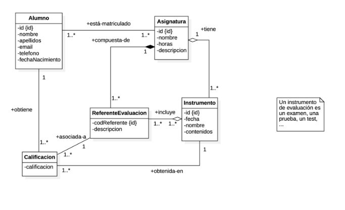
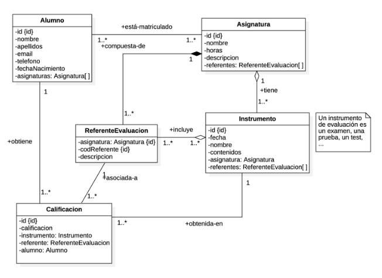

# GradesApp API

Esta API REST permite gestionar información sobre las calificaciones de alumnos en instrumentos de evaluación de diversas asignaturas. La API es parte de la aplicación **GradesApp**, diseñada para gestionar las notas de alumnos.

## Características Principales

- **Gestión de Alumnos:** Agrega, consulta, modifica y elimina datos de alumnos, incluyendo detalles como nombre, apellidos, correo electrónico, teléfono y fecha de nacimiento.

- **Gestión de Asignaturas:** Crea y administra asignaturas, incluyendo información como nombre, horas de clase y descripción.

- **Gestión de Instrumentos:** Registra instrumentos de evaluación, con detalles como fecha, nombre, contenidos, asignatura asociada y referentes de evaluación.

- **Gestión de Calificaciones:** Permite registrar calificaciones de alumnos en los instrumentos de evaluación, lo que facilita un seguimiento preciso del progreso académico.

- **Documentación con Swagger:** Accede a la documentación detallada de la API a través de Swagger, lo que simplifica la comprensión y prueba de los endpoints disponibles. 

## Fuente de código

[Repositorio](https://github.com/alvaropol/gradesapi)

### Modelo de Datos

El modelo de datos de la aplicación está representado por clases como Alumno, Asignatura, Instrumento y Calificación.
Existen dos modelos:

ANÁLISIS:

DISEÑO:

## Uso de la API

La API proporciona varios endpoints para realizar operaciones todos estos endpoints, se puede visualizar con la documentación Swapper del proyecto:

PASOS:

<li> EJECUTAMOS EL PROYECTO CON <u>mvn install</u> Y LUEGO <u>mvn spring-boot:run</u></li>

<li>EN NUESTRO NAVEGADOR INSERTAMOS EN LA BARRA DE NAVEGACIÓN LA SIGUIENTE RUTA:</li>

http://localhost:8080/swagger-ui-gradesapi.html

Este proyecto se encuentra bajo la licencia LICENSE, para obtener información detallada sobre los términos de uso y distribución, consultalo en el archivo LICENSE dentro del [reposito de GIT](https://github.com/alvaropol/gradesapi)

¡Gracias por consultar GradesApi!
